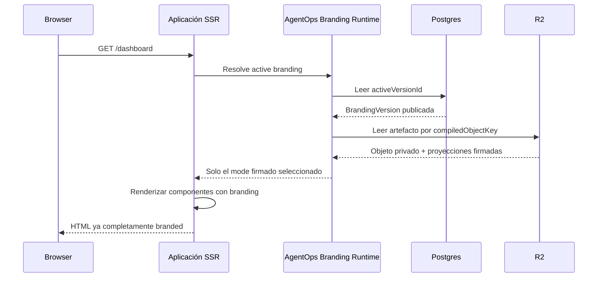

# AgentOps Workspace Branding vNext

## Decision record, target experience, and implementation plan

Status: approved design baseline for implementation  
Date: 2026-07-17  
Primary product surface: `https://branding.agentops.le-mn.com`  
Canonical UI producer: `@lemn-ltd/*` in `/Users/aweaxiecy/Workspaces/ui`  
Temporary control-plane implementation: `/Users/aweaxiecy/Workspaces/agentops-branding-simulator`  
Temporary MCP implementation: `/Users/aweaxiecy/Workspaces/agentops-branding-mcp`

## 1. Purpose

This document is the implementation authority for replacing the current
Project/Environment/Brand/Profile/Revision/Assignment branding model with the
simplified AgentOps Workspace Branding model agreed for the simulator.

It must be sufficient for an implementation agent to:

1. update the public branding contracts and Studio in `lemn-ltd/ui`;
2. replace the current simulator model and user experience at
   `branding.agentops.le-mn.com`;
3. replace the current branding MCP surface with workspace-scoped tools;
4. implement publication, immutable R2 artifacts, SSR resolution, previews,
   embedded fallback, token issuance, audit, and tenant isolation;
5. demonstrate the complete behavior with a real SSR consumer; and
6. remove the legacy branding vocabulary and compatibility paths from the
   delivered target.

This is not a compatibility migration. The simulator is temporary and may be
reset to a clean development baseline. The implementation must not retain
legacy aliases, fallback routes, old DTOs, dual schemas, or hidden translation
layers.

## 2. Applicable patterns

The implementation must follow the current managed pattern authority in each
repository. Materially relevant patterns include:

- `PAT-ARCH-REPO-BOUNDARIES-001`
- `PAT-ARCH-PORTS-ADAPTERS-001`
- `PAT-DATA-POSTGRES-001`
- `PAT-DATA-MIGRATIONS-001`
- `PAT-DATA-R2-001`
- `PAT-CLOUDFLARE-SERVICE-BINDINGS-001`
- `PAT-API-CONTRACTS-001`
- `PAT-API-MCP-001`
- `PAT-SEC-AUTHORIZATION-001`
- `PAT-SEC-TENANT-ISOLATION-001`
- `PAT-SEC-AUDIT-EVENTS-001`
- `PAT-ASYNC-IDEMPOTENCY-001`
- `PAT-UI-BRAND-CONTRACT-001`
- `PAT-UI-SSR-BRANDING-001`
- `PAT-UI-STATES-001`
- `PAT-TEST-EVIDENCE-001`
- `PAT-DOCS-PATTERN-AUDIT-001`

Any pattern text that still names Project, Environment, Brand, Profile,
Revision, Assignment, or assignment sequence must be updated to the canonical
model in this document before that pattern can be claimed as current evidence.

## 3. Product principles

1. A Workspace is AgentOps' canonical unit for coding and non-coding work.
2. One Workspace has exactly one Branding.
3. One Branding has many BrandingVersions and at most one active published
   version.
4. A BrandingVersion holds the complete, provider-neutral
   `BrandingDefinition`.
5. Components retain upstream provider behavior. Branding changes only
   semantic visual configuration and never rewrites provider functionality.
6. The browser must never render an unbranded or provider-default first frame.
7. AgentOps compiles branding. It does not build, compile, or deploy consumer
   applications.
8. Consumer applications own their build and execute branding-aware SSR.
9. Postgres is authoritative for ownership, lifecycle, permissions, active
   version, and audit.
10. R2 stores immutable compiled branding objects and custom assets. R2 is not
    a database or authorization boundary.
11. System brandings are immutable, release-owned templates copied into
    workspace drafts. They do not live-inherit into a Workspace.
12. Agent tokens are scoped to one Workspace. No branding MCP token is scoped
    to an entire Organization.
13. For the first delivery, MCP tokens can use every exposed branding MCP tool,
    but activation remains human-only in the dashboard.
14. Exact versions are always pinned. Package dependencies and system
    branding references must never use `latest`.
15. Data fetching, routing, authentication, global state, and
    internationalization are frontend-platform responsibilities and must not
    be added to `@lemn-ltd/ui`.

### 3.1 Alignment with the AgentOps/Brainscode Cloudflare trust model

Only the branding decisions from the broader AgentOps/Brainscode architecture
apply to this delivery:

- AgentOps remains the trusted source of truth; Postgres owns transactional
  branding state, R2 owns immutable compiled objects, and KV may only be a
  disposable resolution cache.
- A trusted first-party SSR consumer in the same Cloudflare account uses a
  private Service Binding with explicit capability props. It never receives a
  database, R2, queue, MCP, or control-plane binding.
- A future generated or cross-account workload must not receive any Core
  credential or binding. It resolves branding through a narrow authenticated
  HTTPS workload gateway using short-lived, audience-bound workload identity
  and an explicit operation grant.
- Preview origins are isolated from Core sessions and credentials. Preview
  handoff is short-lived, one-use, target-bound, revocable, and leaves no Core
  token in browser storage or the clean URL.
- Runtime identity is derived by trusted infrastructure, never accepted from a
  consumer-supplied organization or Workspace field.

Workers for Platforms, dynamic dispatch, outbound egress control, customer
domains, and workload resource provisioning remain Brainscode/platform scope.
They are intentionally not implemented in `@lemn-ltd/ui`, the branding
simulator, the branding MCP, or Lunaria by this plan.

## 4. Canonical vocabulary

| Term | Meaning |
| --- | --- |
| Organization | AgentOps tenant and authorization boundary. |
| Workspace | Canonical AgentOps work unit. May be coding or non-coding. |
| Branding | The single branding aggregate owned by a Workspace. |
| BrandingVersion | A mutable draft or immutable published branding candidate. |
| BrandingDefinition | The complete source JSON contract for identity and visual configuration. |
| BrandingMode | A complete visual mode such as light or dark. Colors are one section inside a mode. |
| SystemBrandingTemplate | Global immutable LEMN-authored starting point displayed as a “System branding”. |
| CompiledBrandingObject | Immutable implementation artifact stored in R2. It is not a domain entity or Postgres table. |
| BrandingPreviewTarget | A registered application origin capable of rendering a workspace branding preview. |
| BrandingPreviewSession | Short-lived, actor- and target-bound preview of an exact draft snapshot. |
| WorkspaceMcpToken | Opaque credential granting an agent access to branding MCP capabilities for exactly one Workspace. |
| WorkspaceRuntimeCredential | Server-only least-privilege credential used by a consumer application to resolve branding. It is never an MCP token. |

The following legacy branding terms are prohibited in the target domain,
routes, DTOs, UI copy, MCP tools, documentation, and evidence:

- `BrandProject`
- `Brand` as the aggregate name
- `Profile` or `BrandProfile`
- `Revision` or `BrandRevision`
- `Assignment` or `BrandAssignment`
- `Project` for the AgentOps work unit
- Workspace branding `Environment`
- branding `slot`
- `assignmentSequence`
- `activeVersion` as a stored lifecycle state
- `actived`

Infrastructure environments remain valid operational concepts. Development,
staging, and production buckets or Workers isolate deployments; they are not
children of a Workspace and do not appear in the branding domain or Studio.

## 5. Responsibility boundaries

### 5.1 `lemn-ltd/ui`

Owns:

- `BrandingDefinition` schemas and types;
- the deterministic compiler;
- semantic CSS variables and provider adapter projections;
- font catalog and immutable font resource metadata;
- SystemBrandingTemplate catalog;
- persistence-free Brand Studio controls;
- server-neutral artifact verification helpers;
- the new `@lemn-ltd/brand-runtime` consumer package;
- reusable components and blocks that consume compiled semantic tokens; and
- public documentation, examples, package exports, changesets, and tests.

Does not own:

- Workspaces, permissions, database state, R2 bindings, publication jobs,
  runtime credentials, preview sessions, routing, or audit persistence.

### 5.2 AgentOps branding simulator

Owns:

- Workspace, Branding, and BrandingVersion persistence;
- authorization and tenant isolation;
- system-branding discovery and copying;
- async publication and R2 materialization;
- active-version changes;
- preview targets, snapshots, handoff, and expiry;
- Workspace MCP token lifecycle;
- runtime resolution for SSR;
- audit and idempotency;
- the dashboard at `branding.agentops.le-mn.com`; and
- the host adapter for `@lemn-ltd/brand-studio`.

### 5.3 AgentOps branding MCP

Owns:

- MCP Streamable HTTP transport;
- WorkspaceMcpToken authentication;
- tool/resource schemas and discovery;
- workspace-scoped local policy;
- safe errors and request/correlation propagation; and
- delegation to the simulator through a private Service Binding.

It owns no database, R2 bucket, compiler, generic filesystem, generic HTTP,
generic SQL, provider capability, or activation operation.

### 5.4 Consumer application

Owns:

- its application build and deployment;
- mapping an incoming request to its Workspace runtime identity;
- calling AgentOps before emitting HTML;
- mode and preview cookies;
- injection of verified CSS, preloads, and bootstrap state;
- rendering and hydration with the same branding projection; and
- its full-page caching policy.

### 5.5 Braincode or another build platform

If a new application preview release is needed, Braincode/CI builds and deploys
it, then registers the resulting URL as a BrandingPreviewTarget. AgentOps must
not become an application build system.

## 6. Core data model

The persistent branding core consists of three tables in addition to the
existing Organization and Workspace primitives.

```text
Organization
└── Workspace
    └── Branding (1:1)
        └── BrandingVersion (1:N)
```

### 6.1 `branding`

```sql
create table branding.branding (
  organization_id uuid not null,
  workspace_id uuid not null,
  active_version_id uuid null,
  created_at timestamptz not null default now(),
  updated_at timestamptz not null default now(),
  primary key (organization_id, workspace_id)
);
```

Rules:

- a Workspace has one row, created atomically with the Workspace;
- `active_version_id` is null until a version is activated;
- it may reference only a published version from the same Organization and
  Workspace;
- activation uses compare-and-swap with `expectedActiveVersionId`;
- there is no activation sequence; and
- active is a relationship, not a stored BrandingVersion state.

### 6.2 `branding_versions`

```sql
create table branding.branding_versions (
  id uuid primary key,
  organization_id uuid not null,
  workspace_id uuid not null,
  title text not null,
  version integer null,
  state text not null check (state in ('draft', 'publishing', 'published')),
  definition jsonb not null,
  definition_hash text not null,
  compiled_object_key text null,
  compiled_hash text null,
  source_type text not null check (
    source_type in ('blank', 'branding_version', 'system_branding')
  ),
  source_version_id uuid null,
  source_template_id text null,
  source_template_version integer null,
  archived_at timestamptz null,
  archived_by text null,
  last_publication_error_code text null,
  created_by text not null,
  created_at timestamptz not null default now(),
  updated_at timestamptz not null default now(),
  published_at timestamptz null,
  unique (organization_id, workspace_id, id),
  foreign key (organization_id, workspace_id)
    references branding.branding (organization_id, workspace_id)
);

create unique index branding_versions_published_number_unique
  on branding.branding_versions (organization_id, workspace_id, version)
  where version is not null;
```

The implementation must add constraints that enforce:

- draft and publishing versions have `version is null`;
- published versions have non-null `version`, `compiled_object_key`,
  `compiled_hash`, and `published_at`;
- only drafts may have `archived_at`;
- publishing and published versions cannot be archived;
- source fields match `source_type`;
- an active version cannot be archived or non-published; and
- source version references cannot cross Organization or Workspace.

### 6.3 Draft lifecycle

```text
draft ──publish request──> publishing ──materialized──> published
  ▲                              │
  └────────terminal failure──────┘
```

Rules:

- multiple drafts may exist simultaneously;
- drafts have a human-readable `title` for comparison;
- a draft is mutable only while `state=draft` and `archived_at is null`;
- archive is reversible and orthogonal to lifecycle state;
- an archived draft is hidden by default and read-only until restored;
- archived drafts are retained indefinitely in the first delivery;
- publishing locks the definition against editing;
- published versions are immutable; and
- editing a published version requires creating a new draft from it.

### 6.4 Version numbering

Drafts do not consume public version numbers.

```text
Draft        version = null
Publishing   version = null
Published    version = 1, 2, 3...
```

The signed runtime projections include the public numeric version, so a
publication reserves that number durably before signing without exposing it on
the `branding_versions` row. A `branding.publication_slots` table has exactly
one row per Workspace and records the owning BrandingVersion, reserved version,
definition hash, compiled hash, and reservation timestamps.

```sql
create table branding.publication_slots (
  reservation_id uuid not null,
  organization_id uuid not null,
  workspace_id uuid not null,
  branding_version_id uuid not null,
  reserved_version integer not null check (reserved_version > 0),
  definition_hash text not null check (definition_hash ~ '^[a-f0-9]{64}$'),
  compiled_hash text not null check (compiled_hash ~ '^[a-f0-9]{64}$'),
  compiled_object_key text not null,
  reserved_at timestamptz not null,
  updated_at timestamptz not null,
  primary key (organization_id, workspace_id),
  unique (reservation_id),
  unique (compiled_object_key),
  unique (organization_id, workspace_id, branding_version_id),
  unique (organization_id, workspace_id, reserved_version),
  foreign key (organization_id, workspace_id)
    references branding.branding (organization_id, workspace_id)
    on delete cascade,
  foreign key (organization_id, workspace_id, branding_version_id)
    references branding.branding_versions
      (organization_id, workspace_id, id)
    on delete cascade,
  check (updated_at >= reserved_at)
);

create index publication_slots_stale_idx
  on branding.publication_slots (updated_at);
```

The migration also installs a `publication_slots_guard` trigger. It makes the
reservation identity and object key immutable, requires the exact
content-addressed R2 key derived from Organization, Workspace,
BrandingVersion, reserved version, reservation, and compiled hash, and rejects
any slot that no longer points to its exact unarchived `publishing` source and
definition hash.

The reservation transaction locks the Branding aggregate, reuses an identical
slot and `reservation_id` owned by the same publication, rejects a different contender with a
retryable conflict, and calculates `max(published version) + 1`. The
BrandingVersion remains `publishing` with `version = null`. Compilation,
signing, and R2 I/O then happen outside the database transaction using the
reserved number. The final short transaction locks the same aggregate and
slot, verifies every identity and hash, promotes the row to `published` with
the reserved number, and consumes the slot atomically.

Terminal failure or stale-publication reconciliation deletes only the exact
unreferenced immutable object, releases the matching slot, and returns the
version to `draft`. Until the slot is finalized or safely released, no other
draft in the Workspace can reserve a number. This serializes concurrent
successful publications while ensuring archived drafts and failed publications
create no version-number gaps and keeping all network I/O outside database
transactions.

### 6.5 Optimistic concurrency

Every draft mutation requires:

```ts
{
  brandingVersionId: string
  expectedDefinitionHash: string
  operations: JsonPatchOperation[]
  idempotencyKey: string
}
```

The service must:

1. scope the lookup by authenticated Organization and Workspace;
2. lock the version row;
3. reject non-draft, archived, or stale hashes;
4. apply an allowlisted RFC 6902 JSON Patch only within
   `BrandingDefinition`;
5. parse and validate the complete resulting definition;
6. calculate the new deterministic definition hash;
7. persist the update and audit event in the same transaction; and
8. return a stable conflict instead of overwriting concurrent edits.

## 7. BrandingDefinition contract

The target public source contract is:

```text
https://schemas.ui.le-mn.com/branding/v1.json
```

The canonical TypeScript name is `BrandingDefinition`. The old BrandProject
schema and names must be removed, not aliased.

The definition keeps the full current depth while removing Profile:

```ts
interface BrandingDefinition {
  $schema: "https://schemas.ui.le-mn.com/branding/v1.json"
  schemaVersion: 1
  name: string
  metadata: BrandingMetadata
  assets: Record<string, BrandingAsset>
  assetRoles?: BrandingAssetRoles
  typography: BrandingTypography
  defaultModeId: string
  modes: Record<string, BrandingMode>
  runtimeSelection?: {
    selectable: boolean
    allowedModeIds?: string[]
  }
  extensions?: Record<string, unknown>
}
```

`BrandingMode` retains:

- `colorScheme`
- `colors`
- `shape`
- `elevation`
- `spacingAndDensity`
- `motion`
- `visualization`
- `iconography`
- `accessibility`
- `componentAppearance`
- namespaced `extensions`

Colors are not modes. Colors are one semantic token section inside each
complete mode. Typography and asset-role selection are shared at the root.

## 8. System brandings

The product label is **System brandings**. The technical contract is
`SystemBrandingTemplate`.

System brandings are not workspace Branding rows and do not require Postgres
tables in the first delivery. Their authority lives in a side-effect-free,
versioned catalog exported from:

```text
@lemn-ltd/brand-contract/system-brandings
```

The 15 current original LEMN presets become the initial immutable template
versions.

```ts
interface SystemBrandingTemplate {
  id: string
  version: number
  name: string
  description: string
  category: "neutral" | "operational" | "data" | "editorial" | "creative"
  tags: string[]
  status: "available" | "deprecated"
  definition: BrandingDefinition
  definitionHash: string
  compatibility: {
    schemaVersion: number
    minimumCompilerVersion: string
  }
  provenance: {
    owner: "LEMN"
    license: string
  }
}
```

Rules:

- template IDs are stable;
- template versions are immutable and retained;
- references always include exact `templateId` and `templateVersion`;
- `latest` is prohibited;
- selecting a template copies its complete definition into a draft;
- subsequent template releases never change an existing draft or Workspace;
- provenance remains on BrandingVersion for display and audit; and
- editing or publishing templates through AgentOps is deferred until a future
  requirement justifies a separate system-template lifecycle.

## 9. R2 storage and tenant isolation

Use one private artifact bucket per AgentOps deployment environment, not one
bucket per Organization:

```text
agentops-branding-artifacts-development
agentops-branding-artifacts-staging
agentops-branding-artifacts-production
```

Only create resources for environments that actually exist. The simulator
currently needs development only.

Published artifacts:

```text
v1/organizations/{organizationId}/workspaces/{workspaceId}/versions/{brandingVersionId}/{reservedVersion}/{reservationId}/{compiledHash}.json
```

Preview artifacts:

```text
v1/organizations/{organizationId}/workspaces/{workspaceId}/preview-artifacts/{brandingVersionId}/{previewSessionId}/{definitionHash}.json
```

Custom workspace assets:

```text
v1/organizations/{organizationId}/workspaces/{workspaceId}/assets/{assetId}/{sha256}
```

Rules:

- buckets remain private and are accessed only through Worker bindings;
- prefixes provide organization, workspace, and resource organization but are
  not treated as ACLs;
- services derive the key from authorized Postgres records and never accept an
  arbitrary client-supplied R2 key;
- object keys are immutable and content-addressed;
- a published-object key binds both the durable publication slot number and an
  immutable reservation ID, so a released slot can never recreate or race an
  earlier orphan key;
- a preview-object key binds the exact draft and preview session as well as its
  definition hash, preventing two equal definitions owned by different drafts
  or sessions from sharing mutable lifecycle state;
- writes use compare-and-create/conditional PUT;
- Postgres stores object key, hash, ownership, lifecycle, and permissions;
- the private publication object includes the complete compiled artifact, byte
  hash, semantic compiled hash, schema/compiler versions, and private-object
  signature;
- publication also creates one signed minimal runtime projection per allowed
  mode; each has a canonical `projectionHash` and only public asset URLs with
  exact SHA-256/SRI metadata, never source definitions, storage keys,
  credentials, or another mode's configuration;
- duplicate publication deliveries must verify and reuse an identical object;
- incompatible content at an existing immutable key is an integrity failure;
  and
- an orphan reconciler removes objects that were written but never associated
  with a durable version after a safe retention window.

## 10. Asynchronous publication

Publication must use the existing Postgres outbox and Cloudflare Queue
capabilities. Do not compile and materialize published artifacts inside the
human or MCP HTTP request.

### 10.1 Request transaction

`publish_branding_draft` receives:

```ts
{
  brandingVersionId: string
  expectedDefinitionHash: string
  idempotencyKey: string
}
```

In one Postgres transaction:

1. authenticate and authorize the actor/token;
2. scope and lock the draft;
3. reject archived, stale, invalid, or non-draft state;
4. set `state='publishing'` and clear the last error;
5. insert a unique outbox event containing IDs and hashes, not the full
   definition; and
6. persist the idempotency response and audit event.

Return `202 Accepted` with the BrandingVersion ID and `publishing` state.

### 10.2 Queue consumer

The consumer:

1. loads the locked source snapshot by tenant-scoped IDs;
2. verifies `definitionHash` and publishing state;
3. compiles deterministically;
4. fails if diagnostics contain blocking errors;
5. reserves or resumes the Workspace publication slot and its next numeric
   version in a short Postgres transaction;
6. creates and signs one minimal mode projection for every allowed mode using
   that reserved version;
7. conditionally writes the immutable private R2 publication object containing
   the full artifact and signed mode projections;
8. verifies stored bytes, compiled hash, every projection hash/signature, and
   cross-mode publication identity;
9. locks the Branding row and matching publication slot;
10. transitions the row to `published` with the reserved version and its R2
    key/hash while consuming the slot; and
11. appends audit evidence in that same final transaction.

Queue delivery is at-least-once. Event ID, source hash, immutable R2 key, state
checks, idempotency records, and unique constraints must make duplicate
delivery a successful no-op.

After terminal retries, the DLQ/reconciler transitions `publishing` back to
`draft`, records a safe `last_publication_error_code`, and leaves the definition
available for correction and retry.

### 10.3 Activation

Publishing does not change customer-visible branding. Activation is a separate
human-only dashboard command:

```ts
{
  workspaceId: string
  brandingVersionId: string
  expectedActiveVersionId: string | null
}
```

The command verifies human session, tenant, permission, published state,
artifact integrity metadata, and expected active version, then atomically
updates `Branding.activeVersionId` and appends audit evidence.

There is no MCP activation or rollback tool in this delivery. Rollback is the
dashboard activation of an older published BrandingVersion.

## 11. SSR strategy

AgentOps compiles and resolves branding; each consumer application performs its
own SSR before sending the first HTML byte.

The following sequence is an explicit architecture requirement:



### 11.1 Active resolution

For each SSR request, the runtime:

1. authenticates the application's WorkspaceRuntimeCredential or private
   Service Binding context;
2. reads `Branding.activeVersionId` from Postgres;
3. resolves only a published version from the same Workspace;
4. reads or reuses the immutable R2 object by key/hash;
5. verifies private-object signature, byte hash, compiled hash, schema, and
   compiler compatibility;
6. selects the requested allowed, pre-signed mode and verifies its canonical
   projection hash, signature, publication identity, and public assets; and
7. returns only that minimal signed mode object, never the source definition or
   full compiled object.

The active pointer remains a Postgres read so activation is visible on the next
SSR request. Immutable artifact payloads may be cached by `compiledHash` and
served with ETag/`If-None-Match`. `activeVersionId` must not be replaced by KV
authority.

### 11.2 Runtime projection

```ts
interface RuntimeBrandingEnvelope {
  source: 'active' | 'preview'
  modeObject: {
    format: 'lemn.compiled-branding-mode'
    formatVersion: 1
    projectionHash: string
    projection: {
      workspaceId: string
      brandingVersionId: string
      version: number | null
      schemaVersion: number
      compilerVersion: string
      definitionHash: string
      compiledHash: string
      defaultModeId: string
      allowedModeIds: readonly string[]
      modeId: string
      modeHash: string
      colorScheme: 'light' | 'dark'
      criticalCss: string
      bootstrap: BrandingBootstrap
      fontPreloads: readonly FontPreload[]
      fontResourceOrigins: readonly string[]
      assetReferences: readonly PublicAssetReference[]
    }
    signature: ArtifactSignature
  }
}
```

`projectionHash` is SHA-256 over canonical JSON of `projection`. The signature
payload binds Workspace, BrandingVersion, numeric version or preview draft,
schema/compiler versions, definition/compiled/mode hashes, and
`projectionHash`. The consumer recalculates the hash and verifies the signature;
it does not trust transport metadata.

### 11.3 Consumer rendering

`@lemn-ltd/brand-runtime` must:

- resolve active or preview branding on the server;
- enforce a bounded timeout;
- verify compatibility, signature, and hashes;
- inject critical scoped CSS and mode before app markup;
- emit font preloads and safe asset references;
- serialize only a minimal hydration document containing the signed
  `projectionHash` and selected-mode bootstrap;
- carry `data-lemn-branding-projection-hash` and hydrate with exactly the
  server-selected `projectionHash`, mode ID, and mode hash;
- never fetch branding in a browser effect to repair the first render; and
- never expose runtime or MCP credentials to the browser.

### 11.4 Modes

Mode selection is host-owned. A secure host cookie selects an allowed mode;
otherwise the server uses the signed `defaultModeId`. The private artifact may
contain all modes, but the runtime response contains only the pre-signed
selected mode. The first delivery defaults to light when there is no persisted
choice.

### 11.5 Runtime credentials

WorkspaceMcpToken and WorkspaceRuntimeCredential are different credentials.
The application credential has only `branding:resolve`, is stored server-side,
is tied to the exact Workspace/consumer, and cannot create drafts, previews,
publications, or activations.

Prefer a private Service Binding when both Workers are in the same Cloudflare
account. External servers use authenticated HTTPS with the same least-privilege
contract.

### 11.6 Embedded fallback

Each consumer build embeds one exact map of independently signed minimal mode
objects for every allowed mode in a compatible published version. The map
contains no full compiled artifact. Before any mode is used, the runtime
verifies every signature/projection hash and requires all entries to share the
same Workspace, BrandingVersion, version, schema/compiler,
definition/compiled hashes, default mode, and allowed mode set. Resolution
order is:

```text
1. AgentOps active signed mode object
2. Embedded signed mode-object map
3. Never an unbranded/provider-default render
```

Fallback export prefers the exact active published BrandingVersion. For the
first consumer bootstrap only, when `activeVersionId` is still null, it exports
the highest numbered published BrandingVersion in the same Organization and
Workspace. It never selects a draft or `publishing` row and never changes the
active pointer. This bootstrap rule is confined to the release/export
capability; normal SSR resolution remains strictly active-only.

Runtime timeout, unavailable R2, invalid signature/hash, or incompatible
schema/compiler selects the embedded fallback and emits sanitized operational
evidence. Activating a new version requires no application redeploy; a future
build merely refreshes the fallback snapshot.

Preview HTML is always `private, no-store`. Active full-page cache policy is
application-owned and must vary by Workspace, BrandingVersion, mode, and every
other user/application dimension.

## 12. Preview strategy

AgentOps compiles branding only. It must never clone, install, build, or deploy
the consumer application's source code.

### 12.1 Preview levels

1. **Generic Studio preview:** immediate rendering of representative real UI
   components inside AgentOps.
2. **Hosted application preview:** recommended evidence; an already deployed
   application renders an exact draft snapshot during SSR for one user.
3. **Local application preview:** optional developer flow; a local SSR server
   performs the same one-use handoff and runtime resolution.

If application code also changed, Braincode/CI creates a preview deployment and
registers its URL. AgentOps then supplies branding to that deployment.

### 12.2 `branding_preview_targets`

```ts
interface BrandingPreviewTarget {
  id: string
  organizationId: string
  workspaceId: string
  name: string
  origin: string
  callbackPath: string
  audience: string
  externalReleaseReference?: string
  status: "active" | "disabled"
  createdAt: string
  updatedAt: string
}
```

A Workspace may have zero or many targets. A target is not an Environment and
does not select active branding.

### 12.3 `branding_preview_sessions`

```ts
interface BrandingPreviewSession {
  id: string
  organizationId: string
  workspaceId: string
  brandingVersionId: string
  definitionHash: string
  compiledObjectKey: string
  compiledHash: string
  targetId: string
  initialModeId?: string
  createdBy: string
  createdAt: string
  expiresAt: string
  exchangedAt: string | null
  revokedAt: string | null
}
```

Preview creation pins the exact draft definition hash. Later draft edits never
change an existing preview. The UI marks a preview as stale when the current
draft hash differs and offers “Create updated preview”.

### 12.4 Secure handoff

1. The authenticated user selects a target in AgentOps.
2. AgentOps compiles/reuses the exact preview artifact.
3. AgentOps creates a short-lived, actor-, Workspace-, target-, origin-, and
   hash-bound session.
4. A one-use code reaches the registered application callback.
5. The application server exchanges the code server-to-server.
6. The application sets its own `HttpOnly; Secure` host cookie.
7. A `303` redirect removes code/query/fragment state.
8. Subsequent SSR requests resolve the exact preview artifact.
9. “Exit preview” clears the host cookie.

No source JSON, reusable credential, MCP token, runtime secret, or browser
storage participates in the handoff. An expired or invalid preview must render
an explicit “Preview unavailable/expired” state rather than silently showing
active branding.

## 13. Workspace MCP tokens

### 13.1 Model

```ts
interface WorkspaceMcpToken {
  id: string
  organizationId: string
  workspaceId: string
  name: string
  tokenPrefix: string
  tokenHash: string
  scopes: string[]
  status: "active" | "revoked"
  createdBy: string
  createdAt: string
  expiresAt: string
  lastUsedAt: string | null
  revokedAt: string | null
}
```

Persist as `workspace_mcp_tokens`. One Workspace may have many tokens so Codex,
Claude, test automation, and rotation do not share one credential.

### 13.2 Initial policy

- token creation is human-only in the Workspace dashboard;
- the token is tied to one Organization and exactly one Workspace;
- the token is an opaque high-entropy bearer value;
- plaintext is returned once and never persisted;
- Postgres stores a keyed hash/HMAC and a safe display prefix;
- default expiry is 90 days and maximum expiry is 365 days;
- revoke is immediate;
- rotate creates a replacement and supports a bounded overlap;
- current scope is `mcp:branding:*`, meaning every exposed branding MCP tool;
- the schema stores scopes now so future releases can narrow them without a
  database migration;
- audit stores token ID/prefix, actor, tool, resource, and decision, never the
  token or tool source definition; and
- rate limits apply per token and Workspace.

Activation is not an MCP tool, so the wildcard never grants activation.

The authenticated MCP context derives Organization and Workspace from the
token. Branding tools must not accept user-supplied `organizationId` or
`workspaceId`.

A Workspace-scoped token cannot create another Workspace. Workspace creation
remains dashboard-only in this delivery. Future agent-driven Workspace
creation requires a separate Organization bootstrap capability and is outside
this plan.

### 13.3 Target MCP resources

```text
agentops://context
agentops://branding
agentops://branding/versions
agentops://branding/versions/{versionId}
agentops://branding/schema
agentops://branding/system-brandings
agentops://branding/system-brandings/{templateId}/versions/{version}
agentops://ui/catalog
```

`agentops://context` returns the token's Workspace, active published version,
draft counts, archived draft count, and effective scopes without secrets.

### 13.4 Target MCP tools

```text
create_branding_draft
patch_branding_draft
validate_branding_draft
create_branding_preview
archive_branding_draft
restore_branding_draft
publish_branding_draft
```

All inputs use strict schemas, idempotency where mutating, optimistic hashes
where updating, and curated branding-only behavior. `publish_branding_draft`
starts async publication and never activates.

Prohibited MCP tools:

```text
activate_branding_version
rollback_branding
execute_sql
filesystem
http_fetch
get_secret
```

## 14. Target dashboard experience

### 14.1 Information architecture

```text
AgentOps Branding
├── Workspaces
│   └── {Workspace}
│       ├── Branding
│       ├── Agent access
│       └── Audit
├── System brandings
└── Organization audit
```

Suggested routes:

```text
/workspaces
/workspaces/{workspaceId}/branding
/workspaces/{workspaceId}/branding/versions/{brandingVersionId}
/workspaces/{workspaceId}/agent-access
/workspaces/{workspaceId}/audit
/system-brandings
/system-brandings/{templateId}/versions/{version}
/audit
```

### 14.2 Workspace Branding page wireframe

```text
┌──────────────────────────────────────────────────────────────────────────┐
│ Lunaria                                                      [Open app] │
│ Branding · Active version 3 · Light default                              │
├──────────────────────────────────────────────────────────────────────────┤
│ [Overview] [Drafts 2] [Published 3] [Agent access] [Audit]               │
├──────────────────────────────────────────────────────────────────────────┤
│ Active                                                                   │
│ Version 3 · Published Jul 17 · Hash abc123              [Preview]        │
│                                                        [View details]   │
├──────────────────────────────────────────────────────────────────────────┤
│ Drafts                                             [Create draft]        │
│ ┌───────────────────────┐  ┌───────────────────────┐                    │
│ │ Editorial variation   │  │ Calm operations       │                    │
│ │ Valid · Updated 4 min │  │ 2 warnings            │                    │
│ │ [Edit] [Preview]      │  │ [Edit] [Preview]      │                    │
│ │ [Archive] [Publish]   │  │ [Archive] [Publish]   │                    │
│ └───────────────────────┘  └───────────────────────┘                    │
│ [Show archived drafts (4)]                                               │
├──────────────────────────────────────────────────────────────────────────┤
│ Published versions                                                       │
│ Version 3  Active        [Preview]                                        │
│ Version 2                [Preview] [Activate]                             │
│ Version 1                [Preview] [Activate]                             │
└──────────────────────────────────────────────────────────────────────────┘
```

Activation requires a confirmation dialog showing current and target version,
hash, publisher, timestamp, validation status, and the fact that the next SSR
request will observe the change.

### 14.3 Draft editor

The Brand Studio sequence is:

```text
Identity
Starting point
Assets
Typography
Modes
  ├── Light
  └── Dark
Colors
Shape & elevation
Density & motion
Visualization
Iconography
Accessibility
Component appearance
Review & JSON
```

There is no Profile step. System brandings are provided by the host catalog,
not hardcoded inside a React component. The editor supports save status,
validation diagnostics, concurrent-edit conflict, archive/restore, generic
component preview, compare, hosted application preview, and publish.

### 14.4 System brandings page

```text
System brandings
LEMN-maintained, versioned starting points. Applying one creates an editable
copy; existing Workspaces never update automatically.

[Search] [Category] [Density] [Typography]

┌───────────────────┐ ┌───────────────────┐ ┌───────────────────┐
│ live light/dark    │ │ live light/dark    │ │ live light/dark    │
│ Aster Vault · v1  │ │ Verdant Ledger v1 │ │ Ember Studio · v1 │
│ Operational       │ │ Data              │ │ Editorial         │
│ [Details] [Use]   │ │ [Details] [Use]   │ │ [Details] [Use]   │
└───────────────────┘ └───────────────────┘ └───────────────────┘
```

Previews render a standard real component composition in both modes; they are
not screenshots.

### 14.5 Preview flow

```text
Preview “Editorial variation”

Target
○ Lunaria — current deployed application
○ Lunaria — preview release pr-128
○ Local development

Initial mode
○ Light
○ Dark

Duration: 30 minutes

[Open preview]
```

The application displays a persistent, non-customer preview banner containing
draft title, snapshot hash, mode switch, expiry, and Exit preview.

### 14.6 Agent access page

```text
Agent access
Workspace-scoped credentials for Codex, Claude, and automation.

[Generate MCP token]

Codex       aob_mcp_91f2…  Active   Last used 2 min   Expires Oct 15
Claude      aob_mcp_4ca8…  Active   Never used        Expires Oct 15

[Rotate] [Revoke]
```

Generation dialog:

```text
Name: Codex
Expires: 90 days
Permissions: All branding MCP tools

[Generate]

This value is shown once.
aob_mcp_••••••••••••••••••••
[Copy token] [Done]
```

### 14.7 Required UI states

Every query or mutation surface must implement applicable:

- loading;
- empty Workspace/no published version;
- success;
- validation warning and error;
- permission denied;
- concurrent update conflict;
- publishing/pending;
- publication terminal failure and retry;
- archived and restored;
- token plaintext-once;
- token revoked/expired;
- preview compiling, ready, stale, expired, and revoked;
- runtime fallback active; and
- incompatible schema/compiler.

## 15. API surface

Exact route naming may follow the simulator's established Hono/OpenAPI module
conventions, but the stable capability surface must cover:

### Control plane

```text
GET    /api/v1/workspaces
POST   /api/v1/workspaces
GET    /api/v1/workspaces/{workspaceId}/branding
GET    /api/v1/workspaces/{workspaceId}/branding/versions
POST   /api/v1/workspaces/{workspaceId}/branding/versions
GET    /api/v1/workspaces/{workspaceId}/branding/versions/{versionId}
PATCH  /api/v1/workspaces/{workspaceId}/branding/versions/{versionId}
POST   /api/v1/workspaces/{workspaceId}/branding/versions/{versionId}/validate
POST   /api/v1/workspaces/{workspaceId}/branding/versions/{versionId}/archive
POST   /api/v1/workspaces/{workspaceId}/branding/versions/{versionId}/restore
POST   /api/v1/workspaces/{workspaceId}/branding/versions/{versionId}/publish
POST   /api/v1/workspaces/{workspaceId}/branding/versions/{versionId}/activate
GET    /api/v1/system-brandings
GET    /api/v1/system-brandings/{templateId}/versions/{version}
GET    /api/v1/workspaces/{workspaceId}/preview-targets
POST   /api/v1/workspaces/{workspaceId}/preview-sessions
GET    /api/v1/workspaces/{workspaceId}/mcp-tokens
POST   /api/v1/workspaces/{workspaceId}/mcp-tokens
POST   /api/v1/workspaces/{workspaceId}/mcp-tokens/{tokenId}/rotate
DELETE /api/v1/workspaces/{workspaceId}/mcp-tokens/{tokenId}
GET    /api/v1/workspaces/{workspaceId}/audit
```

### Private runtime

```text
POST /internal/v1/branding/resolve
POST /internal/v1/branding/previews/exchange
POST /internal/v1/branding/previews/resolve
POST /internal/v1/branding/fallback/export
```

All stable HTTP contracts use strict validation, OpenAPI, generated clients,
Problem Details, request/correlation IDs, tenant-scoped repositories, and safe
public errors.

## 16. Repository change map

### 16.1 `/Users/aweaxiecy/Workspaces/ui`

#### `packages/brand-contract`

- Replace BrandProject v2 with BrandingDefinition v1.
- Remove Profile, inheritance, defaultProfileId, profile runtime selection,
  profile-scoped typography, and profile compiler projections.
- Lift typography, assets/asset roles, default mode, modes, and mode selection
  to the root.
- Rename exports, schemas, diagnostics paths, compiler APIs, fixtures, and
  tests.
- Introduce `@lemn-ltd/brand-contract/system-brandings`.
- Convert all 15 current presets into complete validated immutable templates.
- Keep font catalog, provenance, accessibility corrections, provider adapters,
  and full mode depth.
- Compile deterministic full artifacts and mode projections.
- Generate the new JSON Schema and compatibility metadata.

#### `packages/brand-studio`

- Remove direct authority over preset data.
- Receive system-branding catalog from the host or headless catalog export.
- Remove Profile management and inheritance UI.
- Edit root typography/assets and complete light/dark modes.
- Add draft title, save/validation status, compare hooks, preview intents,
  archive/restore intents, and publishing state.
- Remain persistence-, routing-, auth-, and data-fetching-free.

#### New `packages/brand-runtime`

- Publish as `@lemn-ltd/brand-runtime`.
- Define private/runtime DTOs independent of Hono and Cloudflare bindings.
- Provide server adapters for Service Binding and authenticated HTTPS.
- Parse a strict minimal mode envelope; recalculate its canonical projection
  hash; verify signed Workspace/publication identity, compatibility, selected
  mode, and exact public asset references. Never accept the full private
  compiled object on the runtime boundary.
- Provide SSR helpers for CSS/preload/bootstrap injection and an all-allowed-mode
  embedded fallback map whose entries are verified before selection.
- Provide preview-cookie parsing contracts without owning host cookies or
  routing.
- Contain no React browser effect that resolves first-paint branding.

#### `packages/ui`

- Continue consuming semantic variables and provider adapters only.
- Remove assumptions about Profile-specific scopes.
- Prove components render from the same compiled mode contract in SSR and
  hydration.

#### Showcase and docs

- Demonstrate all system brandings in light/dark with real components.
- Demonstrate BrandingDefinition JSON and compiler diagnostics.
- Demonstrate SSR bootstrap/fallback contracts without product persistence.
- Replace all legacy terminology and schema URLs.
- Document provider-first behavior, mode semantics, font policy, R2 artifact
  envelope, consumer integration, and pinned package versions.
- Add changesets for every public package contract change.

### 16.2 `/Users/aweaxiecy/Workspaces/agentops-branding-simulator`

#### Persistence

- Replace Project/Environment/Brand/Binding/Draft/Revision/Assignment/Plan/
  Publication/Profile schemas with Workspace/Branding/BrandingVersion.
- Add preview target/session and Workspace MCP token tables.
- Retain generic Organization, membership, audit, idempotency, outbox, and
  workload primitives where they remain canonical.
- Create a reviewed clean simulator baseline migration and DBML.
- Reset only the disposable simulator development database through an explicit
  operator command; do not mutate request-path DDL.

#### Domain/services

- Replace assignment sequence concurrency with definition hash and expected
  active version compare-and-swap.
- Replace revision lifecycle with BrandingVersion lifecycle.
- Simplify publication around one async version materialization use case.
- Retain and adapt the useful R2 conditional-write adapter, queue/outbox,
  cryptographic verification, preview handoff, policy, audit, and Problem
  Details implementations.
- Remove Profile projection and environment/slot policy.
- Add system-branding catalog adapter from the exact pinned UI package.

#### Runtime Worker

- Resolve Workspace from server workload identity, not browser input.
- Read active version from Postgres on each logical resolution.
- Cache immutable artifacts by hash only.
- Return one selected mode projection.
- Support preview exchange/resolution and signed fallback export.
- Remain private through a Service Binding by default.

#### Control-plane UI

- Replace Project and Environment selectors with Workspace navigation.
- Implement the information architecture and sample pages in section 14.
- Host `@lemn-ltd/brand-studio` with generated API clients and TanStack Query.
- Implement token generation/rotation/revocation and plaintext-once UX.
- Implement System brandings gallery and template-to-draft flow.
- Implement draft cards, archive filter, compare, preview, async publish,
  published versions, human activation, and audit.

#### Infrastructure

- Bind a private R2 development bucket, publication Queue, DLQ, Hyperdrive,
  runtime Service Binding, and cryptographic secrets through reviewed Wrangler
  configuration.
- Keep staging and production absent until real independent resources exist.
- Keep deployment scripts environment-scoped and credential-safe.

### 16.3 `/Users/aweaxiecy/Workspaces/agentops-branding-mcp`

- Replace the eleven Project/Environment/Assignment/Profile/plan/apply tools
  with the seven tools in section 13.
- Replace old resources with Workspace Branding resources.
- Replace managed org/target grants with WorkspaceMcpToken authentication.
- Derive tenant/workspace context from the token and omit those IDs from tool
  inputs.
- Keep transport, strict schemas, safe errors, request/correlation context,
  audit delegation, and the private Service Binding.
- Do not expose activation, rollback, generic SQL/filesystem/HTTP, secrets, or
  raw R2 keys.
- Update smoke fixtures to create multiple drafts, archive/restore, detect
  stale hashes, publish idempotently, and prove activation remains unavailable.

## 17. Zero-legacy migration requirements

The implementation must remove, not deprecate:

- BrandProject schema/type/compiler and schema URL;
- Profile inheritance and selectors;
- Project branding routes and copy;
- Workspace branding environments and slots;
- brands, bindings, drafts, revisions, assignments, plans, publications,
  revision_profiles, and assignment sequence tables from the clean simulator
  target;
- old MCP tools/resources/scopes and target grant shapes;
- compatibility DTOs, legacy alert banners, translation adapters, and dual
  OpenAPI operations;
- old documentation, diagrams, fixtures, tests, seeds, scripts, runbooks, and
  evidence that claim the legacy model is current.

The agent must add an automated repository policy check that fails on forbidden
legacy identifiers in maintained source/docs, with only narrowly justified
historical release notes excluded.

## 18. Implementation order

### Phase 1 — Contract authority

1. Implement BrandingDefinition v1 and tests.
2. Implement compiler and artifact envelope.
3. Convert SystemBrandingTemplate catalog.
4. Update Brand Studio.
5. Add `@lemn-ltd/brand-runtime`.
6. Update UI/showcase/docs and publish exact package versions.

Exit gate: all public packages build, validate, package, and compile every
system branding in light/dark without blocking diagnostics.

### Phase 2 — Simulator data and domain

1. Create clean migrations and DBML.
2. Implement repositories with composite tenant scoping.
3. Implement Workspace/Branding/BrandingVersion services.
4. Implement archive/restore, hash concurrency, and human activation.
5. Adapt audit/idempotency.

Exit gate: PostgreSQL integration tests prove constraints, cross-tenant denial,
concurrent patch conflict, version numbering, and activation compare-and-swap.

### Phase 3 — Publication and R2

1. Configure private R2, Queue, and DLQ.
2. Implement transactional outbox request.
3. Implement idempotent consumer and immutable R2 writes.
4. Implement retry, terminal recovery, and orphan reconciliation.
5. Implement artifact signing and verification.

Exit gate: duplicate and reordered deliveries create one published version,
one immutable artifact, and no version-number gaps.

### Phase 4 — Runtime and preview

1. Implement active resolver.
2. Implement preview target/session and secure handoff.
3. Implement fallback export.
4. Integrate `@lemn-ltd/brand-runtime` in a real SSR consumer.
5. Prove hosted and local preview contracts.

Exit gate: SSR delivers branded HTML before hydration for active, preview, and
fallback flows.

### Phase 5 — Dashboard sample and full UX

1. Implement Workspace navigation.
2. Implement Branding overview, drafts, archive, published versions, and
   activation.
3. Implement System brandings gallery/detail/use flow.
4. Implement Studio editor and preview target picker.
5. Implement Agent access token management.
6. Implement audit and every required UI state.

Exit gate: the deployed `branding.agentops.le-mn.com` demonstrates the page
sample and workflows in section 14.

### Phase 6 — MCP

1. Implement WorkspaceMcpToken authentication.
2. Implement resources and seven tools.
3. Implement policy, idempotency, auditing, and safe errors.
4. Run cross-workspace, expiry, revoke, replay, stale-hash, duplicate publish,
   and activation-unavailable smokes.

Exit gate: Codex/Claude can configure a Workspace through MCP without access to
another Workspace or any human-only activation operation.

### Phase 7 — Zero legacy, documentation, and delivery

1. Remove old code, migrations, routes, tests, docs, fixtures, and packages.
2. Update managed pattern profile/audit in each repo.
3. Run all checks, builds, migrations, dry-runs, smokes, accessibility, and
   focused browser evidence.
4. Commit and push each repository in dependency order.
5. Deploy exact package versions, runtime, simulator, dashboard, and MCP.
6. Verify production-like URLs and clean temporary credentials/policies.

## 19. Acceptance criteria

### Data and lifecycle

- Creating a Workspace creates exactly one Branding.
- Multiple named drafts can coexist.
- Archive hides a draft; restore preserves its content/hash.
- Archived drafts cannot mutate, preview, or publish until restored.
- Stale hash updates fail without overwriting changes.
- Drafts and failed publications consume no public version number.
- Concurrent publication finalization produces unique contiguous published
  numbers.
- Published definitions and R2 objects are immutable.
- One human-only activation pointer selects the active published version.
- Concurrent activations use expected active version conflict, not sequence.

### System brandings

- All 15 current LEMN originals appear in the System brandings gallery.
- Each has exact immutable version, live light/dark preview, metadata, and
  compatibility.
- Creating a draft copies the complete exact template definition and records
  provenance.
- Updating the catalog never changes existing drafts or Workspaces.

### Publication and R2

- Publish HTTP/MCP requests return while async materialization proceeds.
- Queue duplicates and retries are idempotent.
- R2 objects are private, tenant-prefixed, content-addressed, signed, and
  verified.
- Postgres is authoritative and stores only object references/hashes.
- Terminal failure restores an editable draft with a safe error and retry.

### MCP and tokens

- A human can generate, copy once, list, rotate, and revoke multiple tokens for
  one Workspace.
- Plaintext is never recoverable after creation.
- The token derives Organization/Workspace context and exposes all seven MCP
  tools initially.
- Cross-workspace access fails indistinguishably.
- Expired/revoked tokens fail on the next request.
- MCP can publish but cannot activate or rollback.
- Every mutation is idempotent and durably audited without source contracts or
  secrets in audit payloads.

### Preview

- Generic Studio preview is interactive and uses real components.
- Hosted preview pins exact draft hash and does not alter active branding.
- Later draft edits mark but do not mutate an existing preview.
- One-use handoff leaves no credential in the clean URL or browser storage.
- Preview SSR is user/session-specific and `no-store`.
- Expired/revoked preview shows an explicit state, not active branding.
- Local SSR preview uses the same runtime contract without sharing MCP tokens.

### SSR and fallback

- Active branding is resolved before the first HTML byte.
- Activation appears on the next SSR reload without application deployment.
- CSS, mode, fonts, provider adapter bootstrap, and component tokens agree.
- Hydration uses the exact server `projectionHash` and mode identity and does
  not repair branding in an effect.
- Runtime credential never reaches the browser.
- Runtime failure or incompatible artifacts use only a verified embedded
  branded fallback.
- Runtime responses and fallback mode objects contain no source definition,
  private storage key, full compiled artifact, credentials, or unselected-mode
  configuration.
- No test captures an unbranded/provider-default frame.

### UI and accessibility

- The information architecture in section 14 is implemented responsively.
- Every required loading/empty/error/permission/pending/conflict/expiry state
  exists.
- Keyboard navigation, focus, labels, dialogs, contrast, reduced motion, and
  light/dark behavior meet the established UI accessibility gates.

### Zero legacy and delivery

- Forbidden legacy branding vocabulary is absent from maintained target code,
  routes, DTOs, tools, UI, docs, and current evidence.
- Packages are exact-pinned and contain no filesystem/workspace aliases in
  published consumers.
- Migrations, OpenAPI, generated clients, DBML, runbooks, patterns, and audit
  evidence agree.
- Current commits are pushed and exact deployed versions are recorded.
- Live dashboard, MCP, runtime, and SSR consumer smokes succeed.
- Temporary secret files, bootstrap policies, and one-time credentials are
  removed after delivery.

## 20. Demonstration script

The final implementation must record evidence for this sequence:

1. Open `branding.agentops.le-mn.com` and create/select a Workspace.
2. Show its automatically created Branding with no active version.
3. Open System brandings and select `Verdant Ledger` at an exact version.
4. Create three named drafts from it.
5. Modify colors, typography, shape, and visualization through Studio/MCP.
6. Archive one draft and prove it is hidden; restore it without content loss.
7. Attempt a stale-hash patch and prove it fails safely.
8. Generate a Workspace MCP token, copy it once, and exercise all MCP tools.
9. Create a long-enough hosted application preview for the preferred draft.
10. Modify the draft, prove the existing preview is pinned/stale, and create a
    second preview for the updated exact hash.
11. Publish the preferred draft through the async pipeline.
12. Prove duplicate Queue delivery creates only version 1 and one R2 object.
13. While the active pointer is still null, export the signed version 1
    fallback through the export-only runtime capability, import it with its
    exact public JWK, and perform Lunaria's one initial vNext deployment.
14. Prove the real application renders both exact preview snapshots during SSR,
    while a normal session renders the signed embedded fallback; then activate
    version 1 from the human dashboard.
15. Reload the consumer without rebuilding and prove SSR now uses version 1.
16. Create and publish version 2, activate it, and prove the next reload uses
    version 2 without another consumer deployment.
17. Activate version 1 again as rollback from the dashboard.
18. Disable runtime access and prove the consumer uses its embedded branded
    fallback without an unbranded frame.
19. Revoke the MCP token and prove its next call fails.
20. Show tenant denial, audit events, hashes, R2 metadata, package versions,
    deploy versions, and cleanup evidence without displaying any secret.

## 21. Deferred capabilities

The following are intentionally deferred and must not be preimplemented as
hidden abstractions:

- Organization-wide MCP tokens;
- agent-created Workspaces;
- activation or rollback through MCP;
- multiple Brandings per Workspace;
- Profiles or runtime-switchable branding families;
- Workspace branding environments, slots, canaries, or percentage rollout;
- system-branding authoring and publication inside AgentOps;
- automatic inheritance from newer system-branding versions;
- AgentOps-owned application builds or deployments;
- KV as active-branding authority;
- automatic hard deletion of archived drafts; and
- a third fallback/LKG persistence layer beyond active runtime and embedded
  fallback.

Any future introduction requires an explicit contract/version decision rather
than a compatibility shim.
